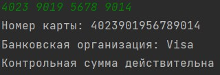
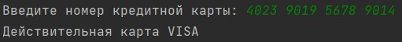

# Код на PHP для определения типа банковской карты и проверки ее номера по алгоритму Луна
### Этот код на PHP представляет собой реализацию алгоритма для определения типа банковской карты и проверки ее номера на корректность. Алгоритм использует регулярные выражения для определения типа карты и алгоритм Луна для проверки корректности номера карты.

## Как работает код
1. Код получает номер карты из консоли.
2. Номер карты очищается от всех символов, кроме цифр.
3. В коде используются регулярные выражения для определения типа карты.
4. Код вычисляет контрольную сумму с помощью алгоритма Луна.
5. Код сообщает тип карты, номер карты и корректность номера.

```php
<?php
// Шаг 1: Получить номер карты из ввода консоли
$card_number = fgets(STDIN);

// Шаг 2: Удалить все нечисловые символы из номера карты
$card_number = preg_replace('/\D/', '', $card_number);

// Шаг 3: Сравнить номер карты с регулярными выражениями, чтобы определить выпустившую банковскую организацию
if (preg_match('/^5[1-5]\d{14}$|^62\d{14}$|^67\d{14}$/', $card_number)) {
    $card_issuer = "Mastercard";
} elseif (preg_match('/^4[1-9]\d{12,18}$|^14\d{12,18}$/', $card_number)) {
    $card_issuer = "Visa";
} else {
    $card_issuer = "Unknown";
}

// Шаг 4: Рассчитать контрольную сумму номера карты с помощью алгоритма Луна
$checksum = 0;
$length = strlen($card_number);
for ($i = 1; $i <= $length; $i++) {
    $digit = substr($card_number, -$i, 1);
    if ($i % 2 == 0) {
        $double = $digit * 2;
        $checksum += ($double < 10) ? $double : ($double - 9);
    } else {
        $checksum += $digit;
    }
}

// Шаг 5: Вывести номер карты, выпустившую банковскую организацию и информацию о том, является ли номер карты действительным или недействительным на основе расчета контрольной суммы
echo "Номер карты: $card_number\n";
echo "Банковская организация: $card_issuer\n";
if ($checksum % 10 == 0) {
    echo "Контрольная сумма действительна\n";
} else {
    echo "Контрольная сумма недействительна\n";
}
```

### Примеры выводов по примерам





## UPD:
Добавил решение через класс с методом validate

```php
<?php
class CreditCardValidator
{
    public static function validate($cardNumber)
    {
        // Шаг 1: Удаляем все нецифровые символы из номера карты
        $cardNumber = preg_replace('/\D/', '', $cardNumber);

        // Шаг 2: Проверяем, что длина номера карты соответствует стандарту ISO/IEC 7812
        $cardLength = strlen($cardNumber);
        if ($cardLength < 13 || $cardLength > 19) {
            return false;
        }

        // Шаг 3: Проверяем, что номер карты проходит алгоритм Луна
        $sum = 0;
        for ($i = $cardLength - 1; $i >= 0; $i--) {
            $digit = (int) $cardNumber[$i];
            if (($cardLength - $i) % 2 == 0) {
                $digit *= 2;
                if ($digit > 9) {
                    $digit -= 9;
                }
            }
            $sum += $digit;
        }
        if ($sum % 10 != 0) {
            return false;
        }

        // Шаг 4: Определяем эмитенту карты по префиксу
        $prefix = substr($cardNumber, 0, 2);
        if (in_array($prefix, range(51, 55)) || $prefix == 62 || $prefix == 67) {
            return 'MasterCard';
        }
        if (in_array($prefix, range(41, 49)) || $prefix == 14) {
            return 'VISA';
        }

        // Шаг 5: Если эмитент карты не распознан, возвращаем false
        return false;
    }
}

// Шаг 6: Читаем номер карты из консоли
echo 'Введите номер кредитной карты: ';
$cardNumber = trim(fgets(STDIN));

// Шаг 7: Проверяем номер карты
$issuer = CreditCardValidator::validate($cardNumber);
if ($issuer) {
    echo "Действительная карта $issuer\n";
} else {
    echo "Неверный номер карты\n";
}
```

### Примеры выводов по примерам





